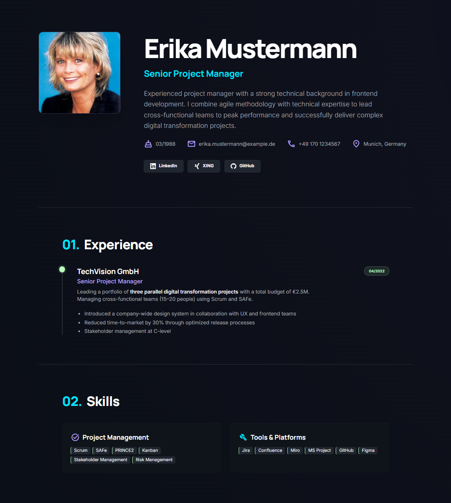
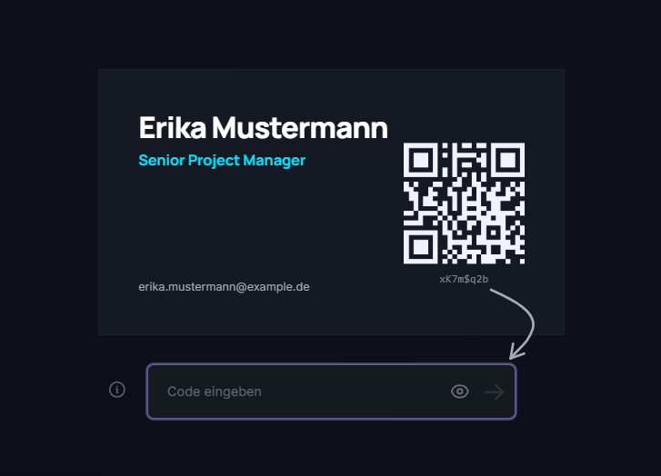

# CV Presenter

> **Disclaimer:** This application was partially created with the assistance of AI. No warranty is provided — use at your own risk.

A self-hosted digital CV behind token-based authentication. Share your resume via QR codes or short access tokens.

<!-- Screenshot: Full CV page overview (desktop), showing header, timeline sections, and skills -->


For technical details, see [docs/architecture.md](docs/architecture.md), [docs/tokens.md](docs/tokens.md), and [docs/admin-space.md](docs/admin-space.md).

## Quick Start (Docker)

```bash
export JWT_SECRET="your-secret-key-at-least-32-characters-long"

docker compose up -d
docker compose logs cv-presenter   # copy the default admin token from the output
```

On first start with an empty volume, Docker automatically populates it with the bundled example data. Open `http://localhost:3000` and paste the admin token.

## Quick Start (Local)

```bash
npm install

export JWT_SECRET="your-secret-key-at-least-32-characters-long"
export DATA_DIR="./data"

# Copy example data for a quick demo, or create your own cv.json
cp example-data/* ./data/

npm run dev
```

The default admin token (valid 24h) is printed to the console on startup.
A `cv.json` file must be present in `DATA_DIR` — the app shows an error page without it.

## Usage

1. **Log in** — paste the admin token at `http://localhost:3000` or visit `http://localhost:3000/?token=<token>`

<!-- Screenshot: Landing page with 3D business card and token entry form -->


2. **Edit CV** — go to Admin Panel → Editor to change personal info, experience, education, and skills
3. **Upload files** — upload a profile image (JPEG/PNG/WebP, max 5 MB) in the personal information section and manage PDF documents (max 10 MB each) in the PDF section at the bottom of the Editor
4. **Generate tokens** — go to Admin Panel → Tokens. Choose a format:
   - **Mini** — 8 characters, viewer only, easy to share by phone or chat
   - **Compact** — short, ideal for QR codes
   - **JWT** — standard format, longer
5. **Share** — copy the token URL or scan the generated QR code

## Environment Variables

| Variable | Required | Default | Description |
|----------|----------|---------|-------------|
| `JWT_SECRET` | Yes | — | Signing secret (min 32 characters) |
| `DATA_DIR` | No | `/app/data` | Persistent data directory |

## Build

```bash
# Production build
npm run build
npm start

# Docker
docker compose build
docker compose up -d
```
