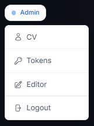
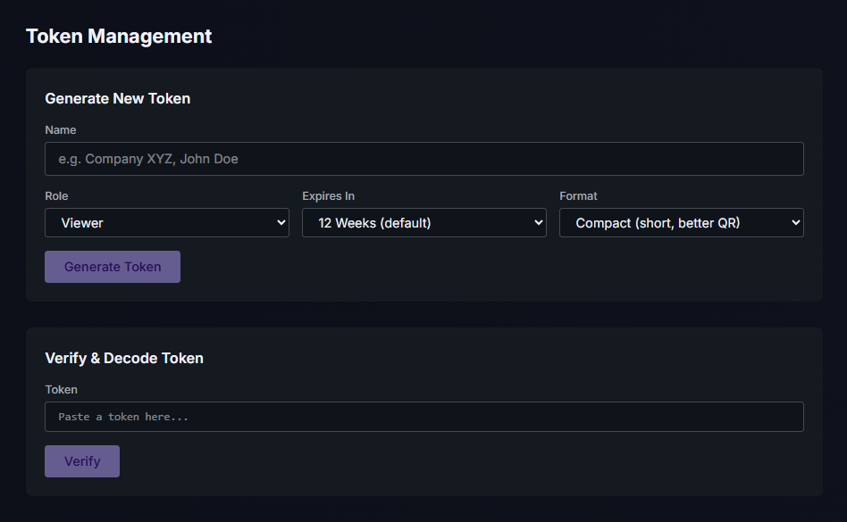
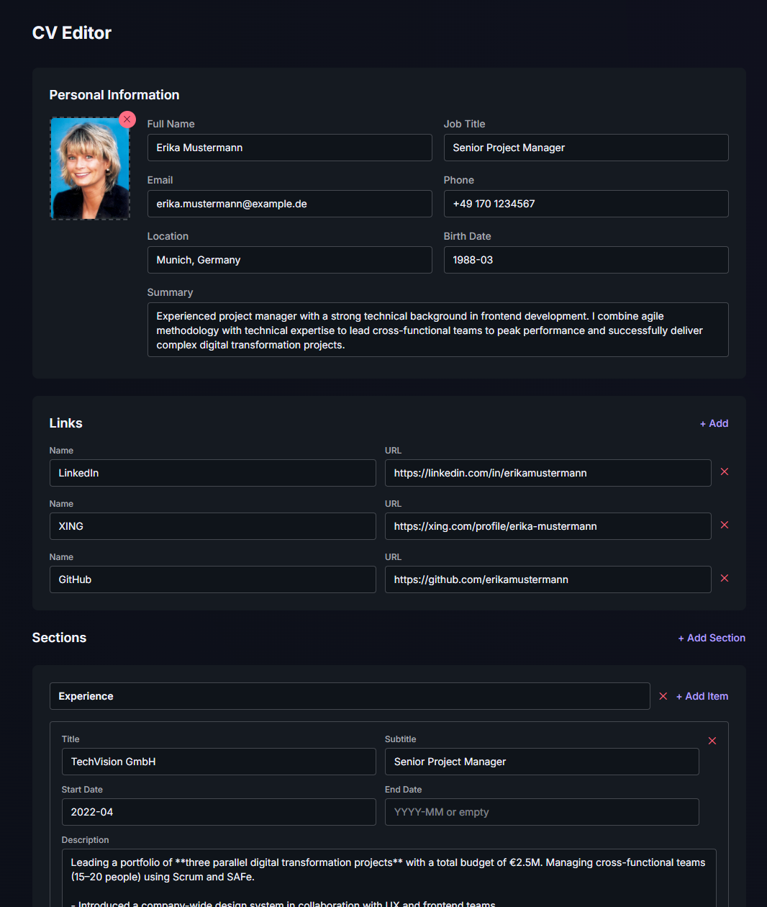
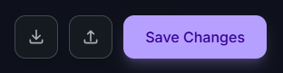
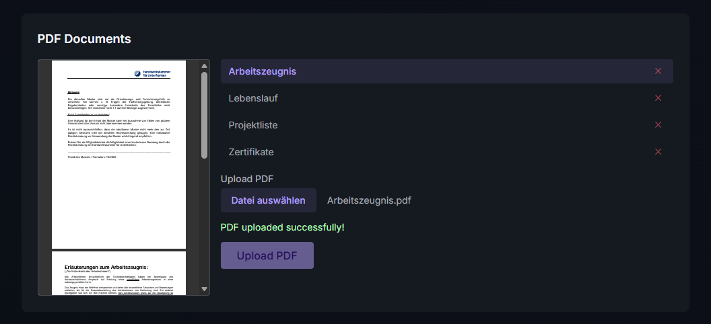
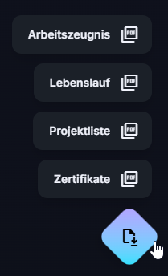

# Admin Space

The admin space is accessible at `/admin` and requires a valid token with the `admin` role. It provides tools to manage all aspects of the CV presentation.

## Access

Admin pages are protected by the admin layout (`/admin/layout.tsx`), which validates the auth cookie and checks `role === "admin"`. Unauthenticated users or viewers are redirected to the homepage.

The floating **Admin Badge** (top-left corner) appears on all pages when logged in as admin and provides navigation to:

- **CV** — the public CV view
- **Tokens** — token management
- **Editor** — CV content editor
- **Logout** — end the session

<!-- Screenshot: Admin badge overlay expanded, showing navigation links -->

## Token Management (`/admin/tokens`)

<!-- Screenshot: Token Management page with generator and verifier -->

### Token Generator

Generate access tokens with configurable parameters:

| Parameter | Options | Notes |
|-----------|---------|-------|
| **Name** | Free text | Required for JWT and Compact formats. Ignored for Mini. |
| **Role** | `admin`, `viewer` | Mini tokens are always viewer-only. |
| **Expiry** | 1h, 24h, 1w, 4w, 12w, 26w, 1y | Mini tokens use day-precision (end of day UTC). |
| **Format** | Mini, Compact, JWT | See [tokens.md](tokens.md) for format details. |

After generation, the component displays:

- The raw token string (copyable)
- A full URL with `?token=` parameter (copyable)
- A QR code encoding the URL (scannable)

### Token Verifier

Paste any token to inspect its contents without setting a cookie. Displays:

- Validity status (valid/invalid/expired)
- Decoded payload: name, role, token ID (jti), issued-at, expiry
- Role shown as a color-coded badge

## CV Editor (`/admin/editor`)

The editor page consists of two main sections: the CV data form and the PDF document manager.

### Personal Information

<!-- Screenshot: CV Editor form — personal info section with profile image, sections, and skills -->

The personal information section includes a **clickable profile image** on the left side. Clicking the image or the placeholder opens a file dialog to select a new photo (JPEG, PNG, or WebP, max 5 MB). The selected image is previewed immediately and uploaded when the form is saved. A delete button (✕) appears on the image to remove it.

Fields:

| Field | Description |
|-------|-------------|
| Full Name | Displayed as the main heading |
| Job Title | Subtitle below the name |
| Email | Contact email with icon |
| Phone | Contact phone with icon |
| Location | Location with icon |
| Birth Date | Optional, displayed with icon |
| Summary | Multi-line text shown below the header |

### Links

Add, edit, or remove links (e.g. LinkedIn, GitHub, XING). Each link has a **Name** and **URL**. Known platforms (GitHub, LinkedIn, XING, Twitter) display brand icons automatically.

### Experience

Job entries with:

- Position, Company
- Start Date, End Date (leave end date empty for current positions)
- Supported date formats: `YYYY-MM`, `MM/YYYY`, `YYYY/MM` — all normalized to `MM/YYYY` on display
- Description (supports Markdown: `**bold**`, `*italic*`, `- list items`)

Entries are displayed chronologically with color-coded timeline dots (current role highlighted).

### Education

Education entries with:

- Institution, Degree, Field
- Start Date, End Date
- Supported date formats: `YYYY-MM`, `MM/YYYY`, `YYYY/MM` — all normalized to `MM/YYYY` on display
- Description (Markdown supported)

### Certifications

Certification entries with:

- Name, Date (supported formats: `YYYY-MM`, `MM/YYYY`, `YYYY/MM`)
- Description (Markdown supported)

### Skills

Skill categories with:

- Category name (e.g. "Languages", "Frontend")
- Icon (optional, [Google Fonts Material Symbols](https://fonts.google.com/icons) name, e.g. `terminal`, `code`, `cloud`)
- Items (comma-separated list of skills)

Skills are displayed in a 2-column grid. If an icon is specified, it appears next to the category name.

### Save & Import/Export

The floating action bar (bottom-right) provides:

- **Download** — export `cv.json` for backup
- **Upload** — import a `cv.json` file (loads data into the form, save to apply)
- **Save Changes** — persist all changes (CV data + profile image if changed)

<!-- Screenshot: Floating save bar with Download/Upload/Save buttons -->

## PDF Document Manager

Located at the bottom of the editor page, full width. Manages multiple PDF files available for download on the public CV page.

### Features

- **File list** — all PDF files in the data directory, displayed without `.pdf` extension. Scrollable after 5 entries.
- **Preview** — clicking a file shows an inline preview (A4-proportioned iframe) on the left side.
- **Upload** — select and upload PDF files (max 10 MB each). Files are stored under their original filename.
- **Delete** — remove individual PDFs via the ✕ button on each list entry.

<!-- Screenshot: PDF Manager with file list, preview, and upload area -->

### Public Download

On the public CV page, a floating speed-dial button (bottom-right) appears when at least one PDF is available. Hovering or clicking opens a menu listing all PDFs by name. Each entry links to `/api/pdf?file=<name>` for direct download.

<!-- Screenshot: Floating download button with expanded PDF menu on CV page -->

## API Endpoints Used by Admin

| Method | Endpoint | Purpose |
|--------|----------|---------|
| `POST` | `/api/auth/token` | Generate new tokens |
| `POST` | `/api/auth/decode` | Inspect/verify tokens |
| `POST` | `/api/auth/logout` | End session |
| `GET` | `/api/cv` | Load CV data for editor |
| `PUT` | `/api/cv` | Save CV data |
| `GET` | `/api/image` | Load current profile image |
| `POST` | `/api/image/upload` | Upload profile image |
| `DELETE` | `/api/image` | Delete profile image |
| `GET` | `/api/pdf` | List all PDFs |
| `GET` | `/api/pdf/preview?file=X` | Preview a PDF |
| `POST` | `/api/pdf/upload` | Upload a PDF |
| `DELETE` | `/api/pdf?file=X` | Delete a PDF |
