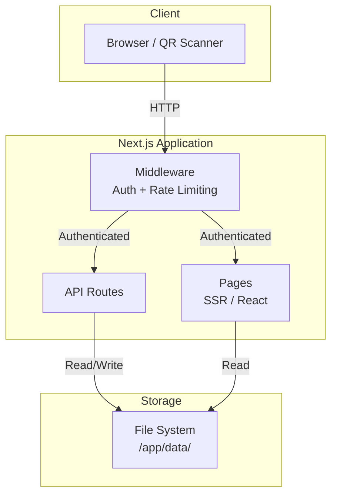
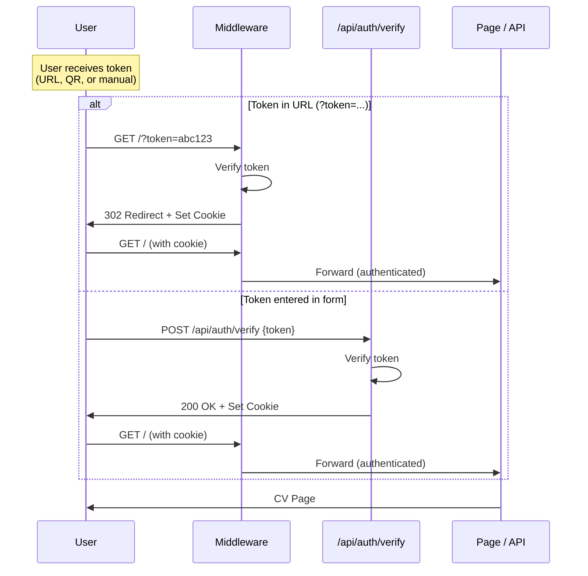
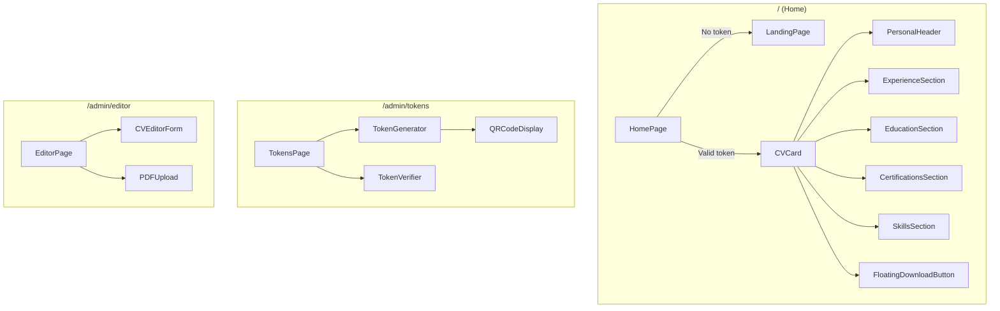
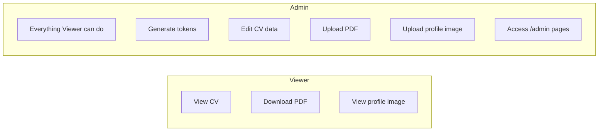
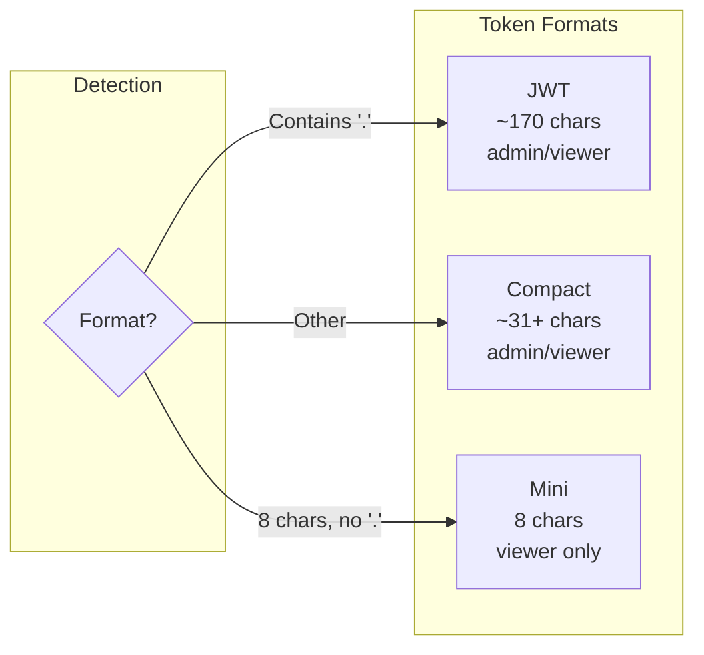
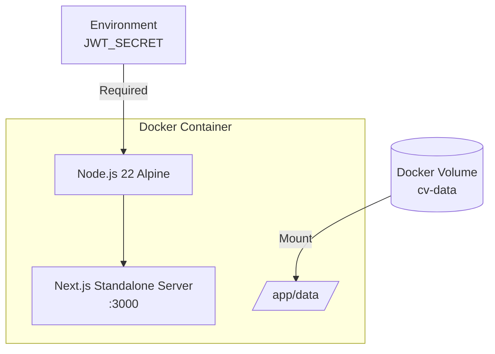

# Architecture

CV Presenter is a self-hosted, single-container Next.js application for presenting a digital CV behind token-based authentication. It runs as a standalone Node.js server with file-based persistence.

## System Overview



## Authentication Flow



## Pages

| Route | Access | Description |
|-------|--------|-------------|
| `/` | Any (shows login if unauthenticated) | Main page — displays `LandingPage` or `CVCard` depending on auth state |
| `/admin` | Admin only | Redirects to `/admin/tokens` |
| `/admin/tokens` | Admin only | Token generation (`TokenGenerator`) and verification (`TokenVerifier`) |
| `/admin/editor` | Admin only | CV data editor (`CVEditorForm` with integrated profile image), PDF management (`PDFUpload`) |

### Page Component Tree



## API Endpoints

### Authentication

| Method | Endpoint | Access | Description |
|--------|----------|--------|-------------|
| `POST` | `/api/auth/verify` | Public | Verify a token and set auth cookie. Input: `{token}`. Returns `{success, role, name}` and sets `cv-presenter-token` cookie. |
| `POST` | `/api/auth/token` | Admin | Generate a new token. Input: `{name, role, expiresIn, format}`. For `format: "mini"`, name is optional and role is forced to viewer. |
| `POST` | `/api/auth/decode` | Authenticated | Decode and inspect a token without setting a cookie. Returns `{valid, payload}` with name, role, jti, issuedAt, expiresAt. |
| `GET`  | `/api/auth/me` | Authenticated | Get current user info: `{authenticated, name, role}`. |
| `POST` | `/api/auth/logout` | Authenticated | Clear the auth cookie. |

### CV Data

| Method | Endpoint | Access | Description |
|--------|----------|--------|-------------|
| `GET`  | `/api/cv` | Authenticated | Get CV data as JSON. |
| `PUT`  | `/api/cv` | Admin | Update CV data. Expects full `CVData` object. |

### PDF

| Method | Endpoint | Access | Description |
|--------|----------|--------|-------------|
| `GET`  | `/api/pdf` | Authenticated | Without `?file=`: list all PDFs as JSON array. With `?file=name`: download named PDF (attachment). |
| `GET`  | `/api/pdf/preview` | Authenticated | Preview named PDF inline (`?file=name`). |
| `POST` | `/api/pdf/upload` | Admin | Upload a PDF file (multipart/form-data, max 10 MB). Stored under original filename. |
| `DELETE`| `/api/pdf` | Admin | Delete a named PDF (`?file=name`). |

### Profile Image

| Method | Endpoint | Access | Description |
|--------|----------|--------|-------------|
| `GET`  | `/api/image` | Authenticated | Get profile image (JPEG, PNG, or WebP). |
| `POST` | `/api/image/upload` | Admin | Upload profile image (multipart/form-data, max 5 MB, JPEG/PNG/WebP). |
| `DELETE`| `/api/image` | Admin | Delete the profile image. |

## Role-Based Access



## Token Formats

Three token formats are supported. See [tokens.md](tokens.md) for full details.



| Format | Signature | Use case |
|--------|-----------|----------|
| **JWT** | Full HMAC-SHA256 (32 bytes) | Standard API integration |
| **Compact** | Truncated HMAC-SHA256 (16 bytes) | QR codes, short URLs |
| **Mini** | Truncated HMAC-SHA256 (4 bytes) | Phone, paper, chat |

## Data Storage

All data is stored on the file system under the `DATA_DIR` directory (default: `/app/data/`):

```
/app/data/
├── cv.json              CV data (JSON)
├── *.pdf                Uploaded PDF documents (multiple, by filename)
└── profile-image.{ext}  Profile image (optional, jpg/png/webp)
```

- **cv.json**: Full CV data including personal info, experience, education, skills (with optional icons), and certifications. Falls back to a default template if the file does not exist.
- **\*.pdf**: Named PDF files available for download via the floating speed-dial button. Managed through the admin editor.
- **profile-image.\***: Profile photo displayed in the CV header. Uploaded via the personal information section in the CV editor.

The data directory is persisted via a Docker volume (`cv-data`).

## Security

### Rate Limiting

All API routes are rate-limited to **30 requests per second per IP** using an in-memory sliding window. The IP is extracted from `x-forwarded-for` or `x-real-ip` headers (for reverse proxy setups).

Exceeding the limit returns `429 Too Many Requests` with a `Retry-After` header.

### Cookie Security

```
httpOnly: true       No JavaScript access (XSS protection)
secure: true         HTTPS only (in production)
sameSite: "lax"      CSRF protection
path: "/"            Sent with all requests
```

### Admin Route Protection

Admin-only API routes are enforced in the middleware:

- `POST /api/auth/token` — token creation
- `PUT /api/cv` — CV data modification
- `POST /api/pdf/upload` — PDF upload
- `DELETE /api/pdf` — PDF deletion
- `POST /api/image/upload` — image upload
- `DELETE /api/image` — image deletion

Non-admin users receive `403 Forbidden`.

## Deployment



### Environment Variables

| Variable | Required | Default | Description |
|----------|----------|---------|-------------|
| `JWT_SECRET` | Yes | — | Signing secret for all token formats. Must be ≥32 characters. |
| `DATA_DIR` | No | `/app/data` | Directory for persistent data (cv.json, cv.pdf, profile image). |
| `NODE_ENV` | No | `production` | Set to `production` for secure cookies. |

### Startup

On startup, the application generates a default admin token (valid 24h) and prints it to the console. This allows initial access without pre-existing tokens.

```
============================================================
CV PRESENTER — Default Admin Token (valid 24h):
============================================================
eyJhbGciOiJIUzI1NiJ9.eyJuYW...
============================================================
```

### Docker Compose

```yaml
services:
  cv-presenter:
    build: .
    ports:
      - "3000:3000"
    environment:
      - JWT_SECRET=${JWT_SECRET}
    volumes:
      - cv-data:/app/data
    restart: unless-stopped

volumes:
  cv-data:
```

## Project Structure

```
src/
├── app/
│   ├── layout.tsx              Root layout (fonts, AdminOverlay)
│   ├── page.tsx                Home page (LandingPage or CVCard)
│   ├── globals.css             Tailwind CSS styles
│   ├── admin/
│   │   ├── layout.tsx          Admin layout (auth guard)
│   │   ├── page.tsx            Redirect → /admin/tokens
│   │   ├── editor/page.tsx     CV editor page
│   │   └── tokens/page.tsx     Token management page
│   └── api/
│       ├── auth/
│       │   ├── decode/         Token inspection
│       │   ├── logout/         Cookie clearing
│       │   ├── me/             Current user info
│       │   ├── token/          Token generation
│       │   └── verify/         Token verification + cookie
│       ├── cv/                 CV data CRUD
│       ├── image/              Profile image serving
│       │   └── upload/         Profile image upload
│       └── pdf/                PDF download
│           ├── preview/        PDF inline preview
│           └── upload/         PDF upload
├── components/
│   ├── AdminOverlay.tsx        Admin badge (shown for admin users on all pages)
│   ├── admin/                  Admin page components
│   ├── auth/                   Auth components (LandingPage, LogoutButton)
│   └── cv/                     CV display components
├── lib/
│   ├── compact-token.ts        Compact token sign/verify
│   ├── crypto-utils.ts         Shared HMAC utilities
│   ├── cv-store.ts             File-based CV data persistence
│   ├── jwt.ts                  Token orchestration (sign/verify/detect)
│   ├── mini-token.ts           Mini token sign/verify
│   ├── rate-limit.ts           In-memory sliding window rate limiter
│   └── types.ts                TypeScript type definitions
├── middleware.ts                Auth, rate limiting, routing
└── instrumentation.ts          Startup admin token generation
```